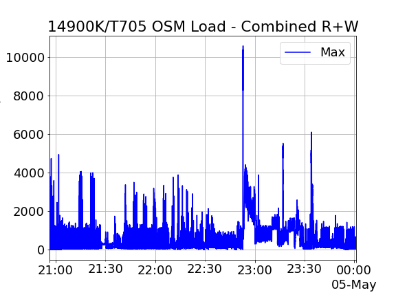

DEPRECATION WARNING!
===================

2025/01/15:  After 18 years _pgbench-tools_ is changing names!  This repo will soon redirect to _pgbent_:  the PostgreSQL Benchmark Toolkit.

The program's coming new documentation will revolve around its recent load generation orchestration features.  That includes metric collection going into a PG database for analysis with arbitrary workload scripts.  _pgbench_ is still the best supported load generator, but the program doesn't need it.  You can supply any script and get a results database comparing it across multiple runs, recording second level precision system metrics and whatever arbitrary database internals queries you want to attach.  A sample connection count query is bundled, you can change or extend that to collect anything you can read via SQL--which for Postgres means just about anything!

While there are plenty of other options for running PostgreSQL scripts and collecting system metrics, the way _pgbent_ is assembled is aimed at providing repeatable standard workloads that can be audited for correctness.  That tookit has allowed creating a small set of novel synthetic database workloads that target the known strong and weak spots of modern storage, ones that respond predictably to database tuning.  Database storage is tricky stuff, and any amount of the metrics time averaging typical to monitoring tools obliterates the interesting peak behavior of modern SSD.

Workloads
=========

For two years now, the most interesting benchmark results have been the Open Street Map tests, published as [blog entries](https://www.crunchydata.com/blog/loading-the-world-openstreetmap-import-in-under-4-hours), [talks](https://www.youtube.com/watch?v=BCMnu7xay2Y), or [social media posts](https://x.com/postgresperf/status/1858905975446556876).  That runs via the pgbent's artibrary workload interface script.  It's classic shell scripting work, there's no use of pgbench.

That said, the pgbench support has also matured during that time.  If you run _pgbent_ on the database server itself, it identifies the system information, saves it so you can remember the configuration, sizes the pgbench workloads for you, and automates running client vs. size grids of several workload types.

There's also a new storage stress test sample program included, [Complete Block Check](tests/cbc/README.md).  That runs anywhere you want, from a psql session to orchestrated via pgbench generating its workload.   I've even run it on our web based [Postgres Playground](https://www.crunchydata.com/developers/playground) to compare web browser block performance. Seriously!

After the rename and associated code reorg, the follow up tech refresh coming in later 2025 is deprecating use of _gnuplot_ in favor of Python Pandas based graphs.  Right now Pandas is behind my slides and social media graph posts; there's still a few old gnuplot graphs left to replace.

Sponsor notes
=============

The soon to be _pgbent_ is supported by a generous time allocation from [Crunchy Data](https://www.crunchydata.com/).  Crunchy has been successfully finding performance and integration issus in new releases with this work for two years now.  2025 is moving the _osm2pgsql_ tests into a Crunchy packaging team data center as a full time QA process.

From project inception on PG8.2/2006 to PG17/2024, all the hardware for the original _pgbench_tools_ development period was personally supplied by Greg Smith, to keep the work independent of employer entangement and vendor influence.  Between hardware and home server lab overhead that gobbled about six figures of investment, offset in the early days by book sales, training classes, and even short selling of The SCO Group.

The long original scope of the program has wrapped up, hardware costs are escalating, books are for old people, and I'm not traveling anymore. That finally and begrudingly has me accepting hardware and potentially other sponsorship ideas.  The first sponsored sample is from Crunchy:  one of the M4 Apple Silicon systems with the 128GB of RAM minimum needed to do well on the Open Street Map tests is coming to the lab next month.

A medium memory sized Apple Silicon vs. Intel vs. AMD showdown is long in the making here.  I've been publishing Intel shootouts [since 1996](https://web.archive.org/web/19980521093812/http://westnet.com/~gsmith/memory.htm) when the competitors were Cyrix and VIA!  In 2020 I did a release day preview of [Apple Silicon's M1](https://www.crunchydata.com/blog/postgresql-benchmarks-apple-arm-m1-macbook-pro-2020).  It's only recently they've released models with enough memory to run more interesting database workloads.

I hope that seeing the best we can do on Apple's popular and standardized hardware platform gives an easy to replicate arm64 result that other core PostgreSQL development can use as a reference.  ARM based cloud servers have been enough of price/performance success for Crunchy's customers we've architected some newer SaaS offerings around them. placing well on benchmarks like [ClickBench](https://benchmark.clickhouse.com/), where unlike most of the competition, we actually [run the query set correctly](https://github.com/ClickHouse/ClickBench/pull/252).

---

Old documentation:  original pgbench-tools
==========================================

pgbench-tools automates running PostgreSQL's built-in pgbench tool in a
useful way.  It will run some number of database sizes (the database
scale) and various concurrent client count combinations.
Scale/client runs with some common characteristic--perhaps one
configuration of the postgresql.conf--can be organized into a "set"
of runs.  The program graphs transaction rate during each test,
latency, and comparisons between test sets.

pgbench-tools setup
===================

* Install GNUplot.

* Create databases for your test and for the results::

      createdb results
      createdb pgbench

  *  Both databases can be the same, but there may be more shared_buffers
     cache churn in that case.  Some amount of cache disruption
     is unavoidable unless the result database is remote, because
     of the OS cache.  The recommended and default configuration
     is to have a pgbench database and a results database.  This also
     keeps the size of the result dataset from being included in the
     total database size figure recorded by the test.

* Initialize the results database by executing::

      psql -f init/resultdb.sql -d results

  Make sure to reference the correct database.

* You need to create a test set with a descritption::

      ./newset 'Initial Config'

  Running the "newset" utility without any parameters will list all of the
  existing test sets.
  
  * Allow linux user to fire the tools::
  
        chmod +x benchwarmer
        chmod +x cleanup

Running tests
=============

* Edit the config file to reference the test and results database, as
  well as list the test you want to run.  The default test is a
  SELECT-only one that runs for 60 seconds.

* Execute::

      ./runset

  In order to execute all the tests
  
HINT:: change the pg_hba.conf or setup a pgpass file to avoid password prompt for each connection (there's a lot of them). You can also `export` the password in your shell session.

Results
=======

* You can check results even as the test is running with::

      psql -d results -f reports/report.sql

  This is unlikely to disrupt the test results very much unless you've
  run an enormous number of tests already.  There is also a helper
  script named summary that shows reports/summary.sql

* A helper script named set-times will show how long past tests have taken to
  complete.  This can be useful to get an idea how long the currently running
  test or test set will actually take to finish.

* Other useful reports you can run are in the reports/ directory, including:
   * `fastest.sql`
   * `summary.sql`
   * `bufreport.sql`
   * `bufsummary.sql`
   * `compromise_params.sql` (see below)
 
* Once the tests are done, the results/ directory will include
  a HTML subdirectory for each test giving its results,
  in addition to the summary information in the results database.

* The results directory will also include its own index HTML file (named
  index.html) that shows summary information and plots for all the tests.

* If you manually adjust the test result database, you can
  then manually regenerate the summary graphs by running:

      ./webreport
      
* If you want to generate a report with selected testsets only (for example sets 1, 6 and 7):

      ./limited_webreport 1,6,7
      
* In case you test for static rates amount (for example sets 2, 8 and 9):

      ./rates_webreport 2,8,9

Test sets comparison
====================

Runs of pgbench via the runset command are oriented into test sets.  Each
test that is run will be put into the same test set until you tell the
program to switch to a new set.  Each test set is assigned both a
serial number and a test description.

New test sets are added like this:

    psql -d results -c "INSERT INTO testset (info) VALUES ('set name')"

pgbench-tools aims to help compare multiple setups of PostgreSQL.  That
might be different configuration parameters, different source code builds, or
even different versions of the database.  One reason the results database is
separate from the test database is that you can use a shared results
database across multiple test sets, while connecting to multiple test database
installations.

The graphs generated by the program will generate a seperate graph pair for
each test set, as well as a master graph pair that compares all of them.  The
graphs in each pair are graphed with a X axis of client count and database
scale (size) respectively.  The idea is that you might see whether an
alternate configuration is better at handling larger data sets, or if it
handles concurrency at high client counts better.

Note that all of the built-in pgbench tests use very simple queries.  The
results can be useful for testing read-only SELECT scaling at different
client counts.  They can also be useful for seeing how the server handles
heavy write volume.  But none of these results will change if you alter
server parameters that adjust query execution, such as work_mem or
effective_cache_size.  Many of the useful PostgreSQL parameters to tune
for better query execution on larger servers in particular fall into
this category.  You will not always be able to compare configurations
usefully using the built-in pgbench tests.  Even for parameters that
should impact results, such as shared_buffers or checkpoint_segments,
making useful comparisons with pgbench is often difficult.

There is more information about what pgbench is useful for, as well as
how to adjust the program to get better results, in the pgbench
documentation:  http://www.postgresql.org/docs/current/static/pgbench.html

Version compatibility
=====================

The default configuration now aims to support the pgbench that ships with
PostgreSQL 9.6 and later versions, which uses names such as "pgbench_accounts"
for its tables.  There are commented out settings in the config file that
show what changes need to be made in order to make the program compatible
with PostgreSQL 8.3, where the names were like "accounts" instead.

pgbench went through major changes in version 9.6, and the random function
used in most test scripts was renamed.  The main tests/ directory has the
current scripts for versions 9.6, 10, 11, 12, and 13 (so far).

To test against versions 8.4 through 9.5, use the tests/tests-9.5 directory
in the confile file.

Support for PostgreSQL versions before 8.3 is not possible, because a
change was made to the pgbench client in that version that is needed
by the program to work properly.  It is possible to use the PostgreSQL 8.3
pgbench client against a newer database server, or to copy the pgbench.c
program from 8.3 into a 8.2 source code build and use it instead (with
some fixes--it won't compile unless you comment out code that refers to
optional newer features added in 8.3).

Multiple worker support
-----------------------

Starting in PostgreSQL 9.0, pgbench allows splitting up the work pgbench
does into multiple worker threads or processes (which depends on whether
the database client libraries haves been compiled with thread-safe 
behavior or not).  

This feature is extremely valuable, as it's likely to give at least
a 15% speedup on common hardware.  And it can more than double throughput
on operating systems that are particularly hostile to running the
pgbench client.  One known source of this problem is Linux kernels
using the Completely Fair Scheduler introduced in 2.6.23,
which does not schedule the pgbench program very well when it's connecting
to the database using the default method, Unix-domain sockets.

(Note that pgbench-tools doesn't suffer greatly from this problem itself, as
it connects over TCP/IP using the "-H" parameter.  Manual pgbench runs that
do not specify a host, and therefore connect via a local socket can be
extremely slow on recent Linux kernels.)

Taking advantage of this feature is done in pgbench-tools by increasing the
MAX_WORKERS setting in the configuration file.  It takes the value of `nproc`
by default, or where that isn't available (typically on systems without a
recent version of GNU coreutils), the default can be set to blank, which avoids
using this feature altogether -- thereby remaining compatible not only with
systems lacking the nproc program, but also with PostgreSQL/pgbench versions
before this capability was added.

When using multiple workers, each must be allocated an equal number of
clients.  That means that client counts that are not a multiple of the
worker count will result in pgbench not running at all.

Accordingly, if you set MAX_WORKERS to a number to enable this capability,
pgbench-tools picks the maximum integer of that value or lower that the client
count is evenly divisible by.  For example, if MAX_WORKERS is 4, running with 8
clients will use 4 workers, while 9 clients will shift downward to 3 workers as
the best option.

A reasonable setting for MAX_WORKERS is the number of physical cores
on the server, typically giving best performance.  And when using this feature,
it's better to tweak test client counts toward ones that are divisible by as
many factors as possible.  For example, if you wanted approximately 15
clients, it would be best to use 16, allowing worker counts of 2, 4, or 8, 
all likely to match common core counts.  Second choice would be 14,
compatible with 2 workers.  Third is 15, which would allow 3 workers--not
improving upon a single worker on common dual-core systems.  The worst
choices would be 13 or 17 clients, which are prime and therefore cannot
be usefully allocated more than one worker on common hardware.

Removing bad tests
==================

If you abort a test in the middle of running, you will end up with a
bad test result entry in the results database.  These will look odd
and can distort averages and graphs.  Ideally you would erase
the entire directory each of those bad test results are in, followed by
removing their main entry from the results database.  You can do that
at a shell prompt like this::

    ./cleanup
    ./webreport 

To cleanup a single value use `./cleanup_singlevalue <testvaluenumber>`
To cleanup all values from a particular starting point use `./cleanup_fromvalue <startingvalue>`

Other utilities
===============

* limited_webreport followed by a comma seperated list of sets
* rates_webreport in the same manner but **only for fixed tps tests**
* **cleanups** (singlevalue, all dirty values, from a value till the end) see "Removing Bad Tests"
* latest_set:  list of tests of the current/latest set (ordered)
* list_orderbyset : lists sets ordered
* lowest_latency (and fastest tests with different degrees of compromise)
* **compromise_params**: allows to see a particular area of scale/client/tps/latency using only sql and no graph

      psql -d results -v lat=15 -v tps=700 -v lscale=900 -v hscale=1000 -v lclients=1 -v hclients=16 -f reports/compromise_params.sql

Known issues
============

* On Solaris, where the benchwarmer script calls tail it may need
  to use `/usr/xpg4/bin/tail` instead
  
TODO: Planned features
=======================

* The client+scale data table used to generate the 3D report would be
  useful to generate in tabular text format as well (not a priority).
* Graphs for buffers/checkpoints throughtout 
* Fix the static number of scales/clients for rates_webreport
* Fix zombie files when crash of bench on OS-stats processes

Contact
=======

The original project is hosted at https://github.com/gregs1104/pgbench-tools
and there is an old version hosted on by the PostgreSQL project at http://git.postgresql.org/git/pgbench-tools.git
or http://git.postgresql.org/gitweb

If you have any hints, changes, improvements, or please contact:

 * Greg Smith gregs1104@gmail.com
 
Notable forks
=============
 
* Future featured upgrades and bug fixes:  https://github.com/emerichunter/pgbench-tools
* Full bash to Python port adding Windows compatibility:  https://github.com/rugging24/pg_pybench

Credits
=======

Copyright (c) 2007-2025, Gregory Smith
All rights reserved.
See COPYRIGHT file for full license details and HISTORY for a full list of
other contributions to the program.

Major contributors:

* Josh Kupershmidt <schmiddy@gmail.com>
* Emeric Tabakhoff <etabakhoff@gmail.com> or <e.tabakhoff@loxodata.com>

******
References:
1. Introduction [1](https://emerichunter.github.io/pgbench-tools-p1/) & [2](https://emerichunter.github.io/pgbench-tools-p2/)
and in french [1](https://www.loxodata.com/post/benchmarking-pratique/) & [2](http://www.loxodata.com/post/benchmarking-pratique2/)

